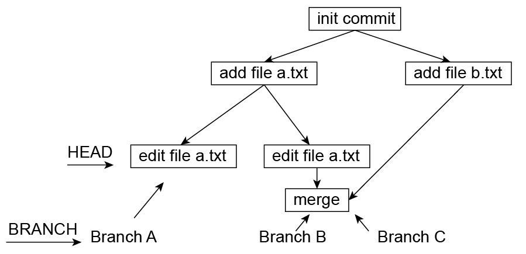

## Gitlet

gitlet 是一个与 git 类似的版本控制软件, 它实现了git的所有基本功能，包括:

init, add, commit, rm, log, global-log,  find, status, checkout, branch, rm-branch, reset, merge. 

gitlet 出自 UCB CS61b课程项目，项目不仅有完善的[文档](https://sp21.datastructur.es/materials/proj/proj2/proj2#the-commands)，还可以在[这个网站](https://www.gradescope.com/courses/225347)上提交代码进行自动测试。 链接中为spring21对应的的资料，随着课程迭代，内容可能会改变。

完成该项目不仅可以练习编程，还能增进对git的认识。以下给出我的实现，使用语言为 Java。

### 基本原理

gitlet 是一个版本控制软件，在编程实践中，一个代码文件往往会被多次修改，修改之后有可能需要退回过去的版本。有时还需要同时维护两个不同的版本，并在需要时进行合并。使用gitlet， 用户可以方便地实现这些功能。

使用gitlet时，首先要选择一个文件夹，将其初始化为一个仓库(repo)，这个文件夹称为工作区(working directory, CWD)。

使用init命令进行初始化。init 会在该文件夹下新建一个隐藏文件夹 ".gitlet"。gitlet 通过不同版本的文件和版本信息保存在".gitlet"中,  并在需要时取出 来实现版本控制。

 ".gitlet"文件夹的结构如下：

```bash
==============================================

└─.gitlet
    │  BRANCH
    │  BRANCHES
    │  HEAD
    │  STAGE_AREA
    │
    ├─commits
    │      3f68cc5a964291f332c978ee1e0dd68965a60e27
    │
    └─files
            da39a3ee5e6b4b0d3255bfef95601890afd80709

==============================================
```

其中，files文件夹用于保存文件，不同文件用sha1哈希进行区分。“gitlet”中还包含其他文件和文件夹用于保存版本信息，将在以下进行说明。

在实践中，我们不可能保存每个文件每一时刻的版本，这将占用过多空间。因此 gitlet 只在用户命令的时候将才将文件进行复制保存。

使用 add 命令可以将文件存入到暂存区(stage area)。add 命令首先将指定的文件复制一份，存到files下。同时，它会用哈希表(HashMap) 记录文件信息，文件名(包含相对路径) 为Key， sha1哈希为Value。这样，如果日后需要恢复该文件的这一版本，只需根据文件名找到sha1哈希，然后从files文件夹中读出对应的文件即可。

为什么 add 命令只是将文件存入暂存区，而不是直接保存成一个版本？在实践中，我们往往不会给每一个文件都保存一个版本，而是将几个文件修改好之后共同保存为一个版本。这样如果需要恢复，就可以根据版本号一次性恢复多个文件。因此，当我们修改好一个文件时，先把它存入一个暂存区，等多个文件修改好了再一起保存成一个版本(当然也可以改了一个文件就保存，没有本质区别)。

使用 commit 命令可以保存一个版本。commit命令要求用户给出一个对该版本的说明信息，其使用格式如下： commit "message"

commit 命令会将暂存区中所有的文件名以及对应的sha1哈希保存下来，并给出一个id，相当于版本号。id是一个40位16进制数，它也是用sha1算法生成的，确保不会重复。除此之外，commit还会保存执行命令的时间以及一个用户给出的注释信息(message)，便于以后查找。

commit 命令不仅会保存暂存区中所有的文件，还会继承上一个commit中的文件。因此commit信息中也需要保存上一个commit的id（parent) 。

如果已经保存了多个commit，如何知道上一个commit是哪个呢？这就需要一个指针HEAD指向当前的commit。指针HEAD中实际上保存的是commit的id，也即一个字符串。

同理，如果需要同时维护多个版本，并在版本之间切换，就需要一个指针指出当前处在哪个版本，还需要多个指针指出每个版本的最后一个commit。

显然，所有commit可以形成一颗树(commit tree)，在init仓库时自动生成一个commit，所有后续的commit都会继承这个commit，因此它可以作为树的根。在合并不同版本时，也会自动进行一次commit， 此时显然这个commit将有多个parent。一个可能的commit tree如下图所示。



我们把不同版本称为不同分支(branch)，在“.gitlet"中用BRANCH记录当前分支的名字，用BRANCHES记录分支名字与其最后一个commitID的对应关系。

### 程序结构

程序包括5个类，如下

#### Main

处理传入的命令行参数，初始化一个Repository对象，根据参数调用Repository的方法

#### Repository
仓库的抽象表示
记录文件保存的地址等信息
负责实现各种git命令

包含成员：

```java
static final File CWD = new File(System.getProperty("user.dir")); #工作区路径
static final File GITLET_DIR = join(CWD, ".gitlet"); # .gitlet路径
static final File COMMIT_DIR = join(GITLET_DIR, "commits"); # commit保存的路径
static final File File_DIR = join(GITLET_DIR, "files"); # 文件保存的路径

static String HEAD;
static String BRANCH;
static HashMap<String, String> BRANCHES;
static StageArea STAGE_AREA;
```

#### StageArea
表示暂存区
包含成员：

```java
HashMap<String, String> files; # filename:filehash 加入或修改的文件
HashSet<String> deleted; # 标记为删除的文件
```

#### Commit
记录一个 commit
包含成员：

```java
String author; # 作者
String date; # 时间
String message; # commit信息
List<String> parents; # parent的commitID
String commitID;
HashMap<String, String> files; # filename:filehash 包含的文件及其sha1哈希
```

#### Blob

表示一个文件

包含成员：

```java
byte[] content; # 文件内容，读入为byte数组
String hash; # 文件内容的sha1哈希
int refer_count; # 引用计数，用于垃圾回收。当没人引用该文件时，就可以删除该文件。
```

#### Utils

一些有用的函数，例如文件的读取和保存，sha1哈希的计算等。

### 实现方法

#### init

新建文件夹，初始化STAGE_AREA等并保存即可。需要生成一个commit。

#### add

如果输入参数是文件夹，考虑文件夹下的所有文件。

如果输入是文件，比较该文件在 CWD，STAGE_AREA， HEAD commit 中的状态。

如果文件不存在于CWD中， 但存在于 STAGE_AREA 或 HEAD commit 中，说明它被删除，将其加入STAGE_AREA 删除区。

如果文件存在于CWD中，而且与 HEAD commit 中的版本相同，则不需要修改。如果此前被STAGE_AREA 标记为修改或删除，则取消这些标记。

如果文件存在于CWD中，而且与 HEAD commit 中的版本不相同，或者HEAD commit 中不存在，则将其加入STAGE_AREA 修改区，并保存一份文件副本。

#### commit

将当前HEAD作为parnet，新建一个commit。将STAGE_AREA 中所有修改并入该commit，然后清空STAGE_AREA 。

同时修改HEAD，BRANCH指针，使其指向新的commit。

#### rm

如果输入文件存在于暂存区中，将其移出暂存区，变成 untracked file。

如果存在于HEAD commit中，将其删除，并在暂存区中标记为删除。

#### log

从HEAD commit 开始输出commitTree中节点的commit信息，直到回到根节点

如果一个节点有多个parent，只使用第一个，忽略其他。

#### global log

输出commits文件夹下的所有commit信息即可

#### find

输出commits文件夹下的所有符合条件的commit信息即可

#### status

status 列出 CWD 和 STAGE_AREA中文件的状态。

考虑CWD中所有文件。文件可以分为5种类型。

staged: 存在于暂存区 STAGE_AREA 中，并且内容相同，但不存在于HEAD commit中

reomved：存在于暂存区中，被标记为删除。

modified: 存在于暂存区中，并且内容不同，或者存在于HEAD commit中，且内容不同。

deleted: 存在于暂存区中，但不存在于CWD中

untracked： 存在于CWD中，但既不存在于暂存区中，也不存在于HEAD commit中

如果文件存在于CWD中，也存在于HEAD commit中， 但不存在于暂存区中，则不需要列出。

#### reset

reset命令会恢复指定commit中的所有文件，同时将当前BRANCHES中当前BRANCH指针指向该commit。

如果HEAD commit中存在的某个文件，指定commit不存在，则从CWD中删除该文件。


#### checkout

checkout有两种功能：
1. 恢复一个文件到指定的commit，
2. 切换branch，即将当前工作区CWD恢复到某个Branch的last commit，并改变HEAD指针和BRANCH指针

要实现第一种功能，只需读入指定的commit，找到其中文件对应的sha1，也即blob id， 然后读入对应的blob，将文件内容写入CWD即可。

要实现第二种功能，只需先根据给定的branch name找到对应的commit id， 然后将文件恢复到指定commit (与reset类似)，然后改变HEAD指针和BRANCH指针即可。

第二种功能在新版本的git中可以由switch命令取代。

#### branch

新建一个branch，但不改变BRANCH指针。只需在BRANCHES中增加其branch名即可，其指针指向当前HEAD commit。

#### rm-branch

删除一个branch，在BRANCHES中删除其branch名和指针即可。

#### merge

将指定branch的内容合并到当前branch。

首先要找到两个branch的 split point， split point 是两个branch节点的最近公共祖先节点。

可以使用两次遍历来找到split point。一次遍历列出branchA的所有祖先，存在哈希表中。第二次遍历对branch进行广度优先遍历，查询哈希表，最先查找成功的节点就是split point。这个方法时间复杂度较高，也可使用更快的算法。

遍历 split point，HEAD,  branchB中的每个文件，考虑文件在这三个commit中的状态。

根据状态对CWD中的文件和STAGE_AREA进行修改，修改规则比较复杂，如下表所示。

| split  point | HEAD | other branch | CWD  | STAGE_AREA |
| ------------ | ---- | ------------ | ---- | ---------- |
| A            | A    | !A           | !A   | modfiy A   |
| B            | !B   | B            | !B   |            |
| C            | C    | X            | X    |            |
| D            | D    | X            | X    | remove D   |
| E            | X    | E            | X    | X          |
| F            | X    | X            | !F   | add F      |
| X            | G    | X            | G    |            |


可见，与split point 相比，如果两个branch中只有一个对某文件进行了修改，那么以修改后的文件为准。

如果两个branch都对某个文件进行了修改，并且修改后的内容一样，那么也以修改后的文件为准。

如果两个branch对某个文件进行了不同的修改，那么会产生冲突merge conflict, 此时要产生一个特殊的conflict文件，将两个文件的内容按如下格式记录：

```bash
<<<<<<< HEAD
contents of file in current branch
=======
contents of file in given branch
>>>>>>>
```

修改好之后进行一次自动commit。