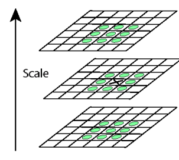
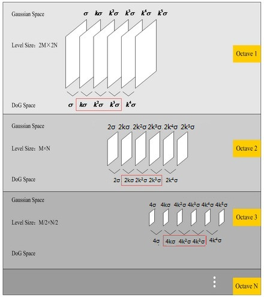
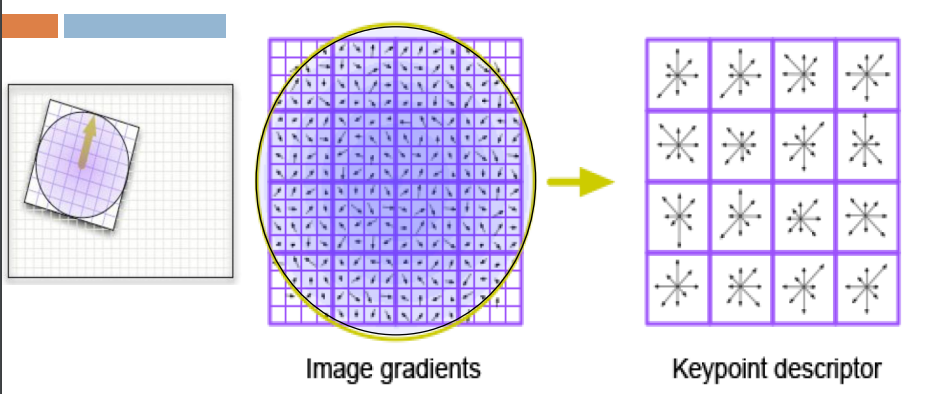

## SIFT(Scale-invariant feature transform)

SIFT特征计算比较复杂，参考原论文和网络资料，总结如下

#### ref

Object recognition from local scale-invariant features

Distinctive Image Features from Scale-Invariant Keypoints

https://www.cnblogs.com/wangguchangqing/p/4853263.html

https://www.cs.bgu.ac.il/~dip211/wiki.files/SIFT.pdf

https://mi.eng.cam.ac.uk/~cipolla/lectures/PartIB/IB-SIFT-extra-material.pdf

https://towardsdatascience.com/sift-scale-invariant-feature-transform-c7233dc60f37

#### 步骤

##### 1.尺度空间极值检测(Scale-space extrema detection)

第一步是计算图像的DoG（差分高斯，Difference of Gaussina），得到DoG金字塔，并寻找其中的极值点

首先对图像进行高斯模糊，即将图像$I(x, y)$与高斯核函数 $G(x, y, \sigma)$进行卷积， 其中
$$
G(x, y, \sigma)=\frac{1}{2 \pi \sigma^{2}} e^{\frac{x^{2}+y^{2}}{2 \sigma^{2}}}
$$
$\sigma$称为尺度空间因子，它是高斯正态分布的标准差，反映了图像被模糊的程度

我们对图像进行S次模糊，第0次$\sigma = \sigma_{0}$, 第$i$次 $\sigma = \sigma_{0}*k^{i}, i = 0,1,..S-1$得到S张模糊后的图像，构成一个图像金字塔，其中$k=2^{\frac{1}{S}}$为常数，是相邻两个高斯尺度空间的比例因子. 相邻图像做差就得到了DoG

对于一张输入图像，我们不只计算一个DoG，而是计算$O=\left[\log _{2} \min (m, n)\right]-a$ 组DoG， 其中a可以取任意值，只要保证O >= 0

不同组区别在于$\sigma_{0} $不同，以及我们对于输入图像进行缩放，使得输入图像的大小也不同.

这里给出第o组第s层的$\sigma$计算公式
$$
\Large \sigma(o, s)=\sigma_{0} \cdot 2^{\frac{o+s}{S}}
$$
以一个512×512的图像I为例:

DoG的组数 $\log _{2} 512 - 3=9 - 3 = 6$

第0组， 将I上采样到 $I_{0} \subset \mathcal{R}^{1024 \times 1024 }$, 计算DoG

第1组，将$I_{0}$ 下采样到$I_{1} \subset \mathcal{R}^{512 \times 512 }$, 计算DoG

第j 组，将$I_{j-1}$下采样..., 计算DoG

这样，我们得到了O组DoG，这可以称为一个DoG空间，这是一个四维空间， 自变量是组，层以及坐标，$D(o, s, i, j)$， 因变量是像素值

接下来要在DoG空间中寻找极值点

我们的DoG空间中有O组图像，每组图像包含S-1张图像，我们遍历这些图像的每个像素点，如果一个像素点$x = D[o][s][(i, j)]$是第o组第s层 (i, j)位置处的像素， 我们需要检查x的8邻域，以及$D[o][s-1][(i, j)]$,$D[o][s+1][(i, j)]$以及它们的8邻域，一共需要检查

$8 + 9 + 9 = 26$个像素,如果x比这些像素都大（或小），那么x是一个极值点。下图直观显示了这些点。

在遍历中我们会发现，每组第一层和最后一层图像没有26个相邻像素，因此无法判断是否是极值点。

为了解决这个问题，我们要额外生成一些图像， 例如在第一层前面和最后一层后面添加一张图像。

SIFT采用的方案是，对图像进行S+3次模糊，这样可以得到S+2的DoG金字塔， 并在寻找极值时忽略第一层和最后一层， 最后空间如图。结合下图与尺度因数的计算公式，可以发现，DoG中的空间尺度变化具有连续性。

经过遍历，我们找到了若干个极值点，这些极值点是候选特征点

接下来删除一些不好的极值点， 我们需要删除低对比度的点和不稳定的边缘响应点

注意我们的DoG空间中一个点由四个参数表示：坐标(i, j)，组编号(o)以及层数(s)

1.删除低对比度的点

 在删除极值点时，我们只考虑同一组的像素，因此o是常数，

此时可以记一个极值点为$\mathbf{z}_{0}=\left[x_{0}, y_{0}, \sigma_{0}\right]^{T}$ ，令$z=[\delta x, \delta y, \delta \sigma]^{T}$ , 泰勒展开
$$
D\left(\mathbf{z}_{0}+\mathbf{z}\right) \approx D\left(\mathbf{z}_{0}\right)+\left(\left.\frac{\partial D}{\partial \mathbf{z}}\right|_{\mathbf{z}_{0}}\right)^{T} \mathbf{z}+\frac{1}{2} \mathbf{z}^{T}\left(\left.\frac{\partial^{2} D}{\partial \mathbf{z}^{2}}\right|_{\mathbf{z}_{0}}\right) \mathbf{z}
$$

对z求导，令导数等于0，求z
$$
\hat{\mathbf{z}}=-\left(\left.\frac{\partial^{2} D}{\partial \mathbf{z}^{2}}\right|_{\mathbf{z}_{0}}\right)\left(\left.\frac{\partial D}{\partial \mathbf{z}}\right|_{\mathbf{z}_{0}}\right)
$$
带入D
$$
D(\hat{x}, \hat{y}, \hat{\sigma})=D\left(\mathbf{z}_{0}+\hat{\mathbf{z}}\right) \approx D\left(\mathbf{z}_{0}\right)+\frac{1}{2}\left(\left.\frac{\partial D}{\partial \mathbf{z}}\right|_{\mathbf{z}_{0}}\right)^{T} \hat{\mathbf{z}}
$$
如果这个值太小，小于某个阈值，对应的特征点将会被删除

2.删除不稳定的边缘相应点

计算：
$$
H=\left[\begin{array}{ll}
D_{x x} & D_{y x} \\
D_{x y} & D_{y y}
\end{array}\right]
$$

$$
\begin{array}{c}
\operatorname{Tr}(H)=D_{x x}+D_{y y}=\alpha+\beta \\
\operatorname{Det}(H)=D_{x x}+D_{y y}-D_{x y}^{2}=\alpha \cdot \beta
\end{array}
$$

$$
\frac{\operatorname{Tr}(H)^{2}}{\operatorname{Det}(H)}=\frac{(\alpha+\beta)^{2}}{\alpha \beta}=\frac{(\gamma \beta+\beta)^{2}}{\gamma \beta^{2}}=\frac{(\gamma+1)^{2}}{\gamma}
$$

我们设定一个阈值$T_{\gamma}$， 检测
$$
\frac{\operatorname{Tr}(H)^{2}}{\operatorname{Det}(H)}>\frac{\left(T_{\gamma}+1\right)^{2}}{T_{\gamma}}
$$
如果如果上式成立，则剔除该特征点，否则保留

##### 2.给特征点分配方向(Orientation assignment)

计算以特征点为中心、以3×1.5σ为半径的区域图像的幅角和幅值，计算公式如下
$$
\begin{array}{c}
m(x, y)=\sqrt{[L(x+1, y)-L(x-1, y)]^{2}+[L(x, y+1)-L(x, y-1)]^{2}} \\
\theta(x, y)=\arctan \frac{L(x, y+1)-L(x, y-1)}{L(x+1, y)-L(x-1, y)}
\end{array}
$$
这样得到了若干对幅角和幅值，统计幅角的直方图，纵轴为幅值

直方图中幅值最大的方向为特征的主方向

如果其他幅值达到了最大幅值的p%, 也将其对应的方向作为特征的方向，此时可以理解为将特征点复制一份，进行方向分配。

##### 3.生成特征点描述(Keypoint descriptor)

以特征点为中心，在附近邻域内将坐标轴旋转θ（特征点的方向）角度
$$
\left[\begin{array}{l}
x^{\prime} \\
y^{\prime}
\end{array}\right]=\left[\begin{array}{cc}
\cos \theta & -\sin \theta \\
\sin \theta & \cos \theta
\end{array}\right]\left[\begin{array}{l}
x \\
y
\end{array}\right]
$$
选取以特征点为中心的16×16的窗口的像素，计算它们的梯度幅值和方向，将窗口内的像素分成4x4块，含有16个像素，统计这些像素的方向-幅值直方图，bins=8,这样得到一个长度为8的向量，16个窗口构成长度为128的向量，作为该特征点的描述

对所有特征点生成描述，就得到了SIFT特征