## YOLO系列总结

### ref

You Only Look Once: Unified, Real-Time Object Detection

YOLO9000: Better, Faster, Stronger

YOLOv3: An Incremental Improvement

YOLOv4: Optimal Speed and Accuracy of Object Detection

YOLOX: Exceeding YOLO Series in 2021

https://docs.ultralytics.com/

https://blog.csdn.net/wjinjie/article/details/107509243

### YOLO v1

#### 输入 

448*448的图片， 标签（训练时）包括图片中每个物体的类别和边界框

#### 步骤

将图片分成S*S的格子(grid cell), 设定每个格子预测B个边界框(bounding box)

用主干网络(backbone)提取图像特征,特征经过全连接层(FC)尺寸变为$S\times S \times (B \times5 + C)$，即对每个格子生成了长度$B \times 5 + C$的预测值，其中C是类别数，$B \times 5$中包含4个坐标值(x, y, w, h)和一个置信度，置信度代表该神经网络认为该边界框中有物体的概率。

计算Loss， 如果标签中物体的中心落在了某个格子中，则由这个格子负责预测这个物体，这个物体的标签只与这个格子的预测值计算Loss。因此，计算Loss之前要对标签进行处理，生成一个指示函数$1^{obj}_{ij}$, 如果 某个物体obj属于$(i, j)$位置的格子，那么指示函数取值为1， 否则为0。有了指示函数后我们可以方便的用公式表示Loss函数。Loss函数可以分别三部分：坐标Loss， 置信度Loss， 分类Loss

坐标Loss, 只是简单计算了预测坐标(x, y, w, h)和标签的偏差，(w, h)开平方根是为了减小数字的数量级，有利于训练。
$$
\begin{array}{l}
\lambda_{\text {coord }} \sum_{i=0}^{S^{2}} \sum_{j=0}^{B} \mathbb{1}_{i j}^{\text {obj }}\left[\left(x_{i}-\hat{x}_{i}\right)^{2}+\left(y_{i}-\hat{y}_{i}\right)^{2}\right] \\
\quad+\lambda_{\text {coord }} \sum_{i=0}^{S^{2}} \sum_{j=0}^{B} \mathbb{1}_{i j}^{\text {obj }}\left[\left(\sqrt{w_{i}}-\sqrt{\hat{w}_{i}}\right)^{2}+\left(\sqrt{h_{i}}-\sqrt{\hat{h}_{i}}\right)^{2}\right]
\end{array}
$$
置信度Loss, 显然，有物体的格子预测出的置信度应该尽量高，没有物体的应该尽量低。$1^{noobj}$取值和$1^{obj}$取值相反，即没有物体时取1。
$$
\begin{array}{c}
\sum_{i=0}^{S^{2}} \sum_{j=0}^{B} \mathbb{1}_{i j}^{\text {obj }}\left(C_{i}-\hat{C}_{i}\right)^{2} \\
+\lambda_{\text {noobj }} \sum_{i=0}^{S^{2}} \sum_{j=0}^{B} \mathbb{1}_{i j}^{\text {noobj }}\left(C_{i}-\hat{C}_{i}\right)^{2}
\end{array}
$$
分类Loss, 每个格子中物体的类别
$$
\sum_{i=0}^{S^{2}} \mathbb{1}_{i}^{\mathrm{obj}} \sum_{\text {c \in classes }}\left(p_{i}(c)-\hat{p}_{i}(c)\right)^{2}
$$
整个过程可以总结为下图

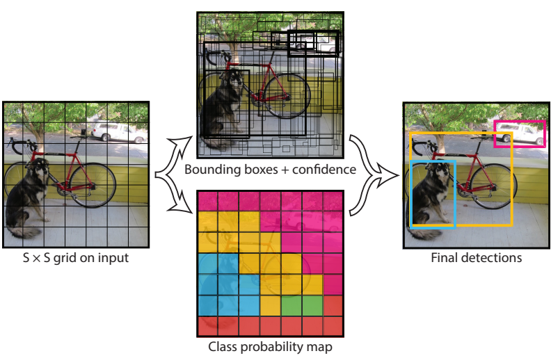

YOLOv1的backbone是由卷积，最大池化和FC构成的，在今天看来非常简单

YOLO v1的速度比同时期的网络快，可以实时处理视频

缺点是一个格子只能有一个类，并且只生成两个边界框，对靠近的物体以及大量物体检测效果不好

### YOLO v2

YOLOv2作者结合CV领域新的研究成果，进行了大量改进

#### 步骤

YOLO v1是anchor free 的，YOLOv2引入了anchor。

首先在训练集上对标签边界框使用K-means聚类，类数为k， 得到k个框(聚类中心)。作者在VOC2007 和 coco两个数据集上聚类，得到了类似的结果，如图，k=5,蓝色为coco，灰色为VOC2007。这k个框的长宽将用于初始化anchor的长宽

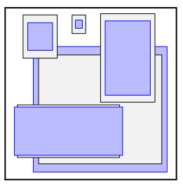

将图片分成S*S的格子(grid cell),每个格子生成B=k个锚框(anchor box)，每个锚框的大小和聚类中心的大小对应。

给锚框分配标签， 采取以下算法进行分配：

1.计算所有标签中边界框与所有锚框的IOU，找出最大IOU，把对应标签分配给对应锚框，删除这个标签和锚框。

2.重复以上步骤，直到所有标签被删除

有些锚框可能不会分配到标签，这时我们将它标记为背景类，它在训练中作为负样本。

接下来提取特征，与YOLOv1对格子预测类别不同，YOLOv2对每个anchor预测类别。

用backbone提取特征，得到$S\times S \times B \times(5 + C)$ 的特征图。这里$B \times 5$中仍然包含4个坐标值$(t_{x}, t_{y}, t_{w}, t_{h})$和一个置信度, 但与YOLOv1不同， $(t_{x}, t_{y})$是anchor中心坐标距离实际中心坐标的偏移量，要加上当前anchor中心坐标才能得到预测坐标, 这里的坐标原点都是当前格子左上角，如图中 $\sigma(t_{y})$,  $\sigma(t_{x})$ 是一个预测坐标。$(t_{w}, t_{h})$也不是边界框的长和宽， 而是$log{\frac{b_{w}}{p_{w}}}$ ,即预测w和锚框w的比值的对数。显然，这种做法更为合理，因为它保证了这四个数值的取值范围对于每个格子是相同的，这使得训练更稳定。注意，虽然图上没有显示，但$(t_{x}, t_{y})$实际上用anchor的长，宽进行了归一化，因此取值范围在0~1之间。

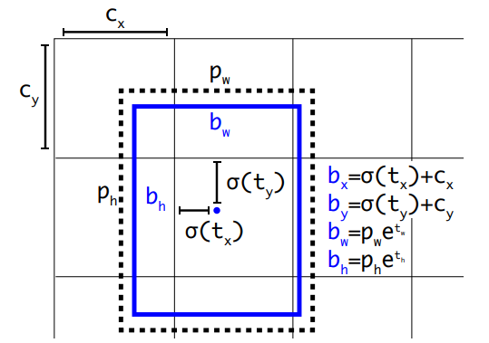

这里原文S=13， B=5, C是数据集的类数。

现在，我们给每个锚框都分配了标签，并且预测出了偏移量和类别，可以计算Loss了。

在计算Loss时，YOLOv2与v1基本思想相同，都包括边界框坐标Loss，置信度Loss和分类Loss。

区别在于 YOLOv2坐标的含义发生了变化，以及分类Loss改用交叉熵Loss

YOLOv2 Loss计算比较复杂，存在大量细节，建议结合代码理解，以下是一个pytorch风格的伪代码，实际代码可以[参考此代码](https://github.com/tztztztztz/yolov2.pytorch)

```python
for epoch in range(epochs):
    for img, gt in data:
        # gt = (batch_size, gt_boxes, gt_classes, num_boxes)
        out = net(img) #img(batch_size, h, w, 3), out(batch_size, 13, 13, number_anchor*5 + number_class)
        out = out.view(batch_size, h * w * num_anchors, 5 + num_classes) 
        xy_pred = torch.sigmoid(out[:, :, 0:2])
        hw_pred = torch.exp(out[:, :, 2:4])
        delta_pred = torch.cat([xy_pred, hw_pred], dim=-1)
        conf_pred = torch.sigmoid(out[:, :, 4:5])
        class_score = out[:, :, 5:]
        class_pred = F.softmax(class_score, dim=-1) # (batch_size, number_anchor, number_calss)
        
        out = [delta_pred, conf_pred, class_pred] 
        bbox_mask, bbox_target, iou_mask, iou_target， class_target = get_mask(out, gt) 
        #iou_mask和conf_pred对应，因为conf其实是预测框和gt的IOU
        # mask 包含根据标签计算出的指示函数的值 指示该图片的每一个anchor是否有物体
        box_loss = MSE(delta_pred*bbox_mask, bbox_target*bbox_mask)
        iou_loss = MSE(conf_pred*iou_mask, iou_target*iou_mask)
        class_loss = cross_entropy(class_pred, class_target)
        loss = w1*box_loss + w2*iou_loss + w3*class_loss
       
```

在进行预测时，我们首先要把网络输出的偏移值加上anchor坐标换算成预测边界框坐标， 这时坐标系还在当前格子的左上角，因此还要再把坐标系换算回原图的左上角。同理，预测边界框的长宽也要换算。

YOLOv2使用了新的backbone网络，如图，[图片来自这里](https://zhuanlan.zhihu.com/p/432343631)

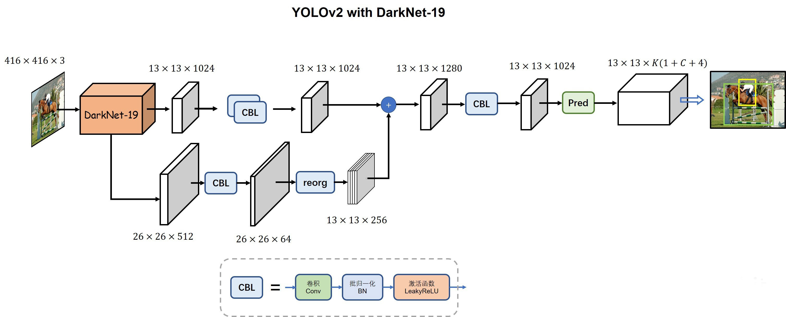

其中，DarkNet-19是一个类似VGG的主干网络，reorg对特征图进行重组

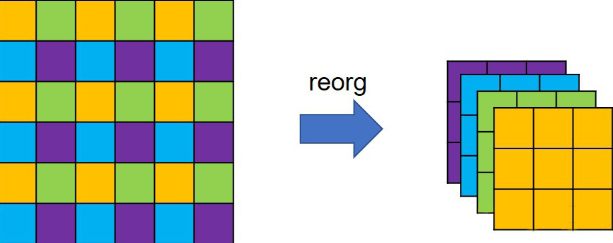

YOLOv2仍然很快，以下是它与同期其他算法的速度对比图，蓝色代表不同输入尺寸的YOLOv2，在VOC2007上测试。

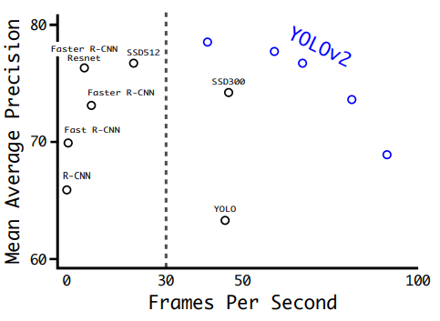

### YOLO v3

YOLOv3的训练步骤，损失函数与v2相同，但置信度Loss和分类Loss都使用交叉熵。

YOLOv3对网络结构进行了改进，并使用了多尺度预测和多标签分类

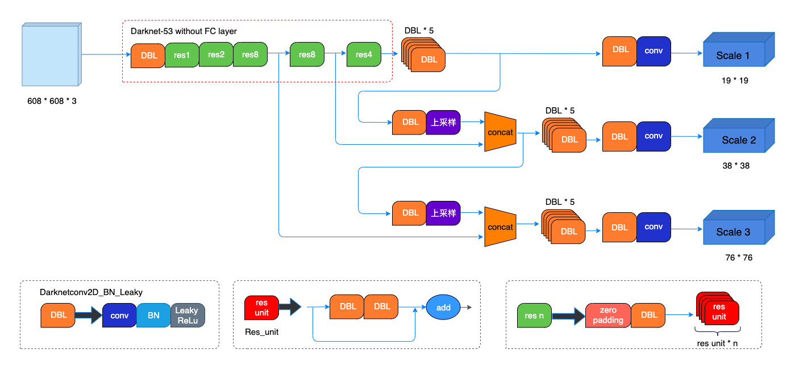

以下是YOLOv3推理速度与其他算法的对比图

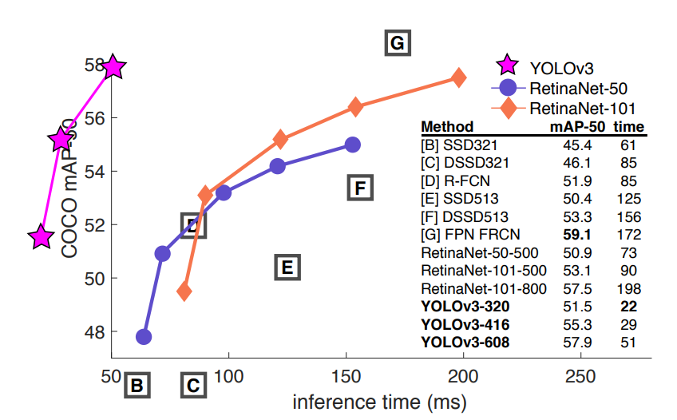

### YOLO v4

YOLOv4对网络结构进行了改进

如图，YOLOv4的网络结构借鉴了CSPNet(Cross Stage Partial Network), SPP(Spatial Pyramid Pooling)和PANet(Path Aggregation Network)

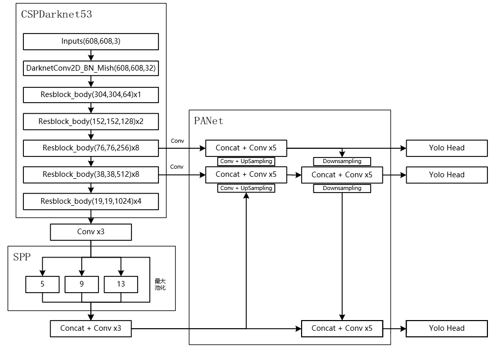

CSPNet是为了减小计算量而设计的，它可以在不损失精度的条件下将计算量(BFLOPs)减小20%。

CSPNet的主要思想是将feature map拆成两部分，一部分进行卷积操作，另一部分和上一部分卷积操作的结果进行连接。下图是一个将其用在ResNet上的例子。

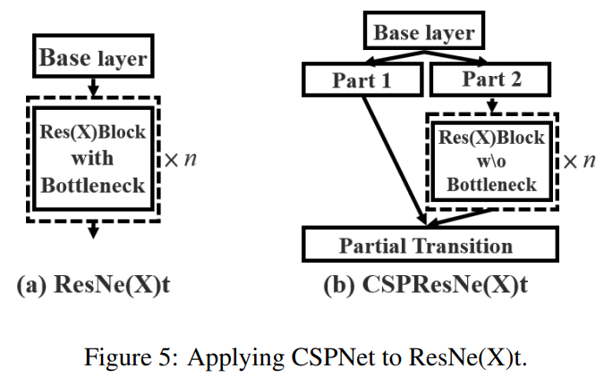

SPP对特征图进行不同尺寸的空间池化， 得到空间池化金字塔，然后将结果在空间方向展开并拼接起来。

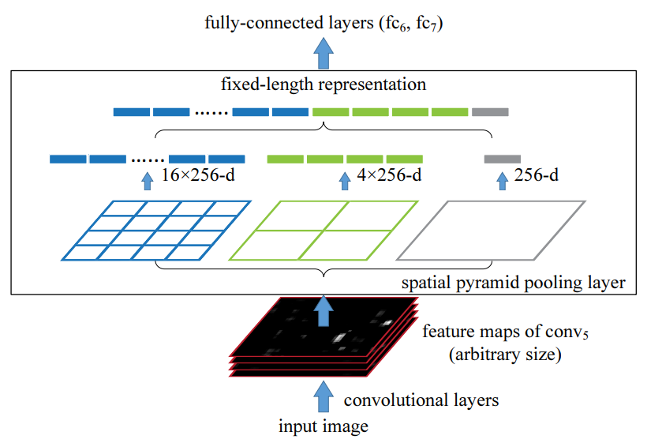

SPP操作简单，可以参考代码理解，如下，[来源](https://phimos.github.io/2020/07/21/RN-SPPLayer/)

```python
import torch
import torch.nn as nn

class SpatialPyramidPooling(nn.Module):
    def __init__(self, levels = 3, pooling='max'):
        super(SpatialPyramidPooling, self).__init__()
        self.levels = levels
        self.mode = pooling
        self.pooling_method = nn.AdaptiveMaxPool2d if pooling == 'max' else nn.AdaptiveAvgPool2d
        self.layers = [self.pooling_method(i) for i in range(1, levels+1)]
        
    def forward(self, x):
        b, c, _, _ = x.size()
        pooled = []
        for p in self.layers:
            pooled.append(p(x).view(b, -1))
        return torch.cat(pooled, -1)
    
    def outputdim(self, previous_channel):
        return previous_channel * sum([i*i for i in range(1, self.levels+1)])
```

PANet

PANet提出自下而上的路径增强(Bottom-up path augmentation)和适应性特征池化(Adaptive feature pooling)技术

作者认为底层纹理信息对于图像分割也是重要的，然而经过较深的网络之后，这些信息很容易丢失，因此，作者构建了一条只有10层左右的shortcut。下图是PANet的结构图，其中红色虚线标出了底层信息本来的传播路径，可以看出它经过backbone传播，层数可达到100多层。绿色虚线标明了作者提出的shortcut路径，可以看出其先横向传播，再向上传播，经过层数较少。

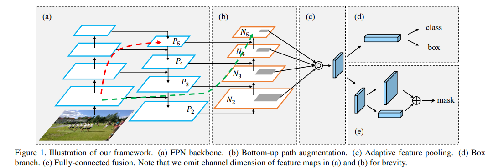

Adaptive feature pooling是一个简单的操作。如下图，左边是一个特征金字塔(FPN)，假设灰色区域是某个proposal对应的区域，进行ROI Align，得到固定尺寸的特征，拉长为一列，不同尺度的特征进行融合，得到最终特征。融合可以采用求和或者取最大值。

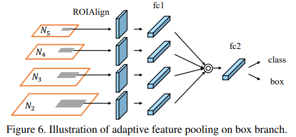


YOLOv4中使用了大量Trick。作者将Trick分为两类：不增加推理时间的称为免费包(Bag of freebies)，增加少量推理时间的称为特价包(Bag of specials)。

YOLOv4在backbone中使用的免费包有CutMix和Mosaic数据增强，DropBLock正则化，Class label smoothing;

使用的特价包有Mish激活函数，CSP连接，MiWRC(Multi input weighted residula connections)

### YOLO v5

YOLOv5没有论文，只有作者在github中放出的源码

YOLOv5对网络结构进行了改进。[图片来自这里](https://github.com/ultralytics/yolov5/issues/280)

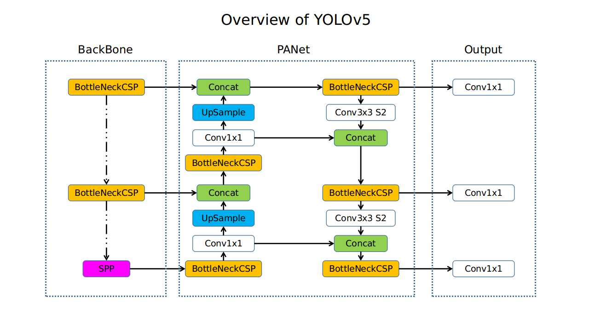

### YOLOX

[来源](https://blog.csdn.net/YMilton/article/details/120268832)

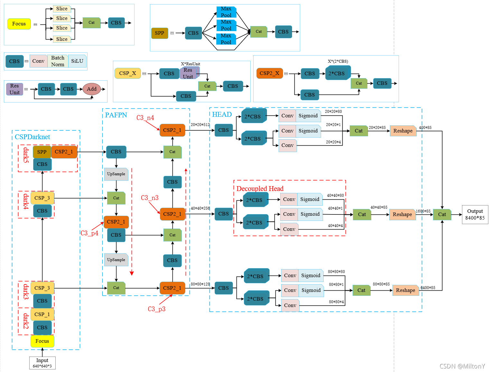